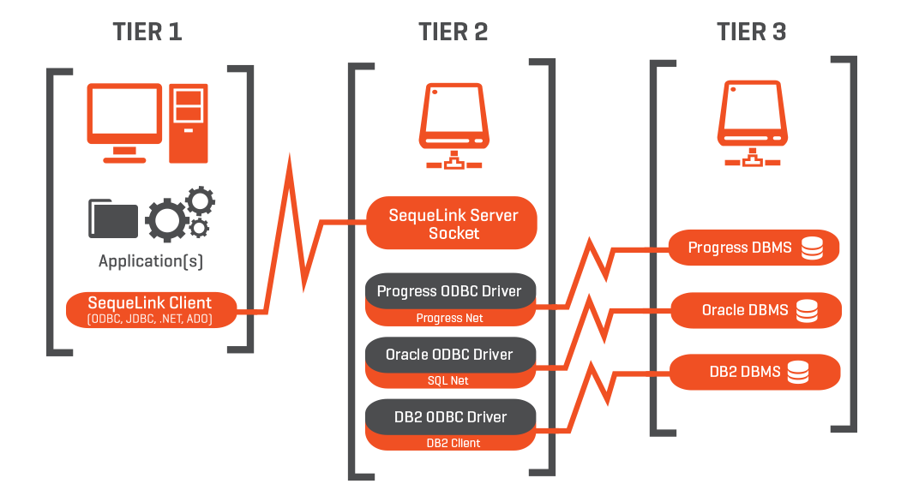

# Socket Client-Server

[<<< DSLabs](https://github.com/FMCalisto/DSLabs)

A socket is one end of a connection via a computer network. Currently, communication between computers is done often with [Internet Protocol (IP)](https://en.wikipedia.org/wiki/IP_address). The most common sockets use [TCP (Transmission Control Protocol)](https://en.wikipedia.org/wiki/Transmission_Control_Protocol), which establish a connection between client and server. A socket address consists of an IP address and a [port number](https://en.wikipedia.org/wiki/Port_(computer_networking)).

===================================================

Distributed Systems Group 35
-------------------

Daniel da Costa

69720

daniel.da.costa@tecnico.ulisboa.pt

-------------------

Filipe Fernandes

73253

filipe.duarte.fernandes@tecnico.ulisboa.pt

-------------------

Francisco Maria Calisto

70916

francisco.calisto@tecnico.ulisboa.pt

-------------------
